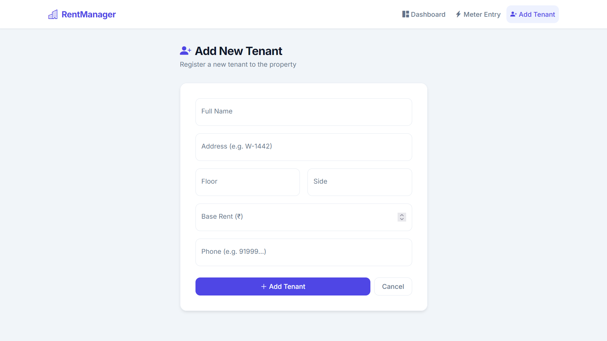

# Automated Rent & Utility ETL Pipeline

## Overview
A centralized, multi-tenant property management platform engineered to replace manual, error-prone Excel bookkeeping. This application automates the ingestion of monthly utility readings, executes conditional pricing transformations, and dynamically generates itemized financial reports for landlords and tenants. 

**Screenshots:**
**
*[Data Entry View](link_to_entry_image.png)*

## Architecture & Data Flow
This project functions as a complete ETL (Extract, Transform, Load) pipeline:
* **Extract:** Raw consumption metrics are ingested via a secure web interface (Flask/HTML) and validated before processing.
* **Transform:** Python business logic calculates month-over-month utility usage, applies property-specific flat fees (e.g., sanitation surcharges), and computes total arrears. 
* **Load:** Relational data is securely committed to a cloud-hosted MySQL database (Aiven), enforcing strict referential integrity between tenant profiles and historical readings.

## Core Features
* **Relational Database Management:** Engineered a MySQL schema to handle one-to-many relationships between tenants and utility logs, utilizing foreign keys to ensure data consistency during deletions.
* **Automated Reporting:** Generates dynamic WhatsApp invoice links using URL encoding, allowing instant, error-free communication of financial statements to end-users.
* **Secure Access Control:** Implemented Basic Auth protocols to protect the administrative dashboard and financial records from unauthorized access.

## Tech Stack
* **Backend:** Python, Flask
* **Database:** MySQL (Aiven Cloud), `mysql.connector`
* **Data Processing:** Pandas (Legacy scripts)
* **Frontend:** HTML/CSS (Jinja2 Templates)
* **Deployment & Monitoring:** Render, UptimeRobot